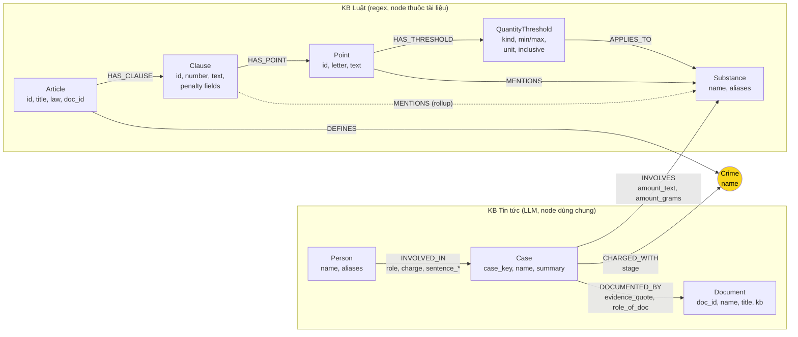

# Thiết kế Ontology — Day 19

**Họ tên:** Đinh Tuấn Long  **MSSV:** 2A202602620

**Lựa chọn** (đánh dấu một):
- [ ] Dùng ontology gợi ý (có thể chỉnh nhỏ)
- [x] Tự thiết kế (xét bonus +15, xem `SUBMISSION.md`)

> Thiết kế theo hướng **deep legal hierarchy + case/evidence provenance** (`LAB_GUIDE.md` Bước 2).
> Trạng thái: đã cài đặt; `pytest tests/ -q` = 48 passed; `bench_kg.py --check` = 7 `[OK]`; `bench_kg.py --judge` đã chạy và ghi `ket_qua_benchmark_kg.txt`. Các ô "Trả lời được?" và bằng chứng dưới đây là kết quả thật từ graph đã dựng.

## 1. Sơ đồ

**Node cầu nối ngữ nghĩa:** `Crime` — luật định nghĩa tội (`Article-DEFINES->Crime`), tin gán tội cho vụ (`Case-CHARGED_WITH->Crime`). `Document` là cầu nối **provenance** (không phải cầu nối ngữ nghĩa).

## 2. Entity types (node labels)

| Label | Ý nghĩa | Khóa định danh (`MERGE` theo) | Properties chính | `doc_id`? | Lấy từ KB nào | Trích bằng |
| --- | --- | --- | --- | --- | --- | --- |
| `Article` | Một Điều luật (`Điều 250 BLHS`, `Điều 2 Luật PCMT`) | `id` = `metadata["article"]` | `id`, `title`, `law`, `doc_id` | Có | Luật | regex (metadata + tiêu đề) |
| `Clause` | Một khoản BLHS, hoặc một mục đánh số của PCMT | `id` = `"{article} khoản {n}"` | `id`, `number`, `text`, `penalty_raw`, `penalty_min_months`, `penalty_max_months`, `penalty_life`, `penalty_death`, `penalty_kind`, `doc_id` | Có | Luật | regex `^(\d+)\.\s` |
| `Point` | Một điểm a/b/c… trong khoản BLHS | `id` = `"{clause id} điểm {letter}"` | `id`, `letter`, `name` (hiển thị), `text`, `doc_id` | Có | Luật | regex `^([a-zđ])\)\s` trong clause |
| `Crime` | Tội danh chuẩn hóa | `name` (đã `normalize_crime`) | `name` | Không (dùng chung) | Luật (tiêu đề `Tội …`) + tin (charge qua `link_entity`) | regex + `link_entity` |
| `Substance` | Chất ma túy/tiền chất chuẩn hóa | `name` | `name`, `aliases` | Không (dùng chung) | Cả hai | danh sách chuẩn + substring (luật), LLM (tin) |
| `QuantityThreshold` | Một ngưỡng số lượng/thể tích/số cây của một điểm | `id` (xem mục 6) | `id`, `kind`, `min_value`, `max_value`, `unit`, `min_inclusive`, `max_inclusive`, `raw_text`, `substance_group_raw`, `doc_id` | Có | Luật | regex (chỉ dòng có ngưỡng) |
| `Case` | Một vụ việc thật, có thể được nhiều bài báo phản ánh | `case_key` (xem mục 4) | `case_key`, `name`, `summary`, `date` | Không (dùng chung) | Tin | LLM + chuẩn hóa khóa |
| `Person` | Người liên quan (bị cáo, bị can, nghi phạm…) | `name` | `name`, `aliases` | Không (dùng chung) | Tin | LLM |
| `Document` | Một file bài báo nguồn (provenance) | `doc_id` = `Document.id` | `doc_id`, `name` (= title, để `seed_facts` hiển thị), `title`, `kb`, `published_at`, `source_url` | Có | Tin | front matter |

**Quyết định `Penalty`: chọn B — trường có cấu trúc trên `Clause`, không tạo node riêng.** Lý do: cả Q3/Q4/Q5 đều hỏi khung hình phạt gắn với đúng một khoản (`blhs-251.md:17`, `blhs-255.md:47-51`, `blhs-250.md:87-91`); không có câu hỏi nào cần truy vấn "mọi khoản có cùng khung". Node `Penalty` sẽ thêm một bước nhảy, thêm `MERGE`/constraint, mà không tăng khả năng trả lời; các trường số (`min_months`, `max_months`, `penalty_life`, `penalty_death`) đủ để so sánh và lọc. Giữ `penalty_raw` để trích dẫn nguyên văn.

## 3. Relationships

| Type | Từ → Đến | Properties trên cạnh | Ý nghĩa / dùng cho câu nào |
| --- | --- | --- | --- |
| `HAS_CLAUSE` | `Article → Clause` | — | Cấu trúc Điều → khoản. Q1, Q3, Q4, Q5 |
| `HAS_POINT` | `Clause → Point` | — | Cấu trúc khoản → điểm. Q4 (điều kiện khoản 4), Q5 (điểm ngưỡng) |
| `DEFINES` | `Article → Crime` | — | Cầu nối luật. Q3, Q4, Q5 |
| `MENTIONS` | `Point → Substance` | — | Chất xuất hiện thật ở cấp điểm (chính xác). Q5 |
| `MENTIONS` | `Clause → Substance` | — | Rollup của các điểm trong khoản, để lọc nhanh 1 hop (giữ tương thích ý tưởng HINT). Q5, E2 |
| `HAS_THRESHOLD` | `Point → QuantityThreshold` | — | Một điểm có thể có nhiều ngưỡng (khối lượng/thể tích). Q5 |
| `APPLIES_TO` | `QuantityThreshold → Substance` | `group_order` (thứ tự trong danh sách nhóm) | Nhóm chất mà ngưỡng áp dụng. Q5 |
| `CHARGED_WITH` | `Case → Crime` | `stage` (bắt/truy tố/xét xử, có thể rỗng) | Cầu nối tin. Q3, Q4, Q5 |
| `INVOLVES` | `Case → Substance` | `amount_text`, `amount_grams` (đã chuẩn hóa), `unit`, `amount_qualifier` (`hơn`/`gần`/`khoảng`/rỗng) | Khối lượng theo vụ. Q5, Q6 |
| `INVOLVED_IN` | `Person → Case` | `role`, `charge`, `sentence_text`, `sentence_months` | Vai trò và mức án theo người. Q2, Q3, Q4 |
| `DOCUMENTED_BY` | `Case → Document` | `evidence_quote`, `published_at`, `role_of_doc` (`primary`/`follow_up`/`teaser`) | Provenance: bài báo nào chống lưng cho vụ/fact nào. Q2, Q3, Q5, Q6 |

**Provenance dùng `DOCUMENTED_BY`, không dùng `MENTIONED_IN`.** "Mentioned in" chỉ nói bài báo có nhắc tới; teaser ở cuối bài cũng "nhắc" một vụ khác, nên sẽ trộn lẫn. `DOCUMENTED_BY` diễn đạt quan hệ *nguồn chứng cứ* (vụ được bài báo ghi nhận), kèm `evidence_quote` + `role_of_doc` để phân biệt bài chính với teaser/follow-up — đúng yêu cầu `Case identity != Document identity`.

## 4. Node cầu nối giữa 2 KB

- **Node nào:** `Crime` (cầu nối ngữ nghĩa). `Document` giữ vai trò provenance, không thay cầu nối.
- **Vì sao chọn node này:** tội danh là khái niệm duy nhất xuất hiện ở cả hai KB: luật có tiêu đề `"Điều N BLHS. Tội …"` (`blhs-dieu-251.md:3,15`), tin có charge do LLM trích (`NEWS_EXTRACTION_PROMPT`, `src/graph.py:97-117`).
- **Cách đảm bảo hai phía khớp tên:** `normalize_crime` hai phía; khớp chính xác trước, sau đó `link_entity` (difflib cutoff 0.8, trả chính tả gốc) — đúng hợp đồng KG-1. Danh sách tội chuẩn lấy từ tiêu đề 13 điều BLHS và được nhét vào prompt trích xuất.
- **Khi nào cầu gãy, và xử lý thế nào:**
  - LLM trả JSON sai dạng / bỏ trống `charges` → không có `CHARGED_WITH`; retry + kiểm JSON trước khi nạp (chi phí retry rất nhỏ).
  - Charge lạ (vd "chống người thi hành công vụ" trong `news-100260926112415229.md:14`) không khớp tội nào của Chương XX → `link_entity` trả `None`, không nối bừa; vụ đó không có cầu nối tới luật ma túy, chấp nhận được.
  - Teaser cuối bài nhắc vụ khác → tạo `DOCUMENTED_BY` với `role_of_doc='teaser'` để `context()` loại khỏi dữ kiện chính (provenance vẫn ghi nhận trung thực).
  - Biến thể Unicode NFD/NFC trong 4 file tin → chuẩn hóa khi tạo khóa (chi tiết ở mục 8).

## 5. Competency questions

| Câu | Đường đi (Cypher pattern) | Trả lời được? |
| --- | --- | --- |
| Q1 | `(:Article {doc_id:'pcmt-dieu-2'})-[:HAS_CLAUSE]->(cl:Clause {number:4}) RETURN cl.text` | Có — flat và graph đều đúng (judge 2); định nghĩa nằm gọn trong 1 chunk luật |
| Q2 | `(:Document {doc_id:'news-100260928173914514'})<-[:DOCUMENTED_BY]-(k:Case)<-[r:INVOLVED_IN]-(p:Person) WHERE r.sentence_text CONTAINS 'tử hình' RETURN p.name` | Có — flat và graph đều đúng (judge 2); 2 người + mức án nằm trong 1 bài |
| Q3 | `(:Person {name:'Lê Minh Thành'})-[r:INVOLVED_IN]->(:Case)-[:CHARGED_WITH]->(:Crime)<-[:DEFINES]-(a:Article {id:'Điều 251 BLHS'})-[:HAS_CLAUSE]->(cl:Clause {number:1}) RETURN r.sentence_text, a.id, cl.penalty_raw` | Có — graph: recall 1.00, judge 2 (36 tháng + Điều 251 + khung 02–07 năm); flat: "Không đủ thông tin" |
| Q4 | `(:Person {name:'Dương Minh Tuấn'})-[:INVOLVED_IN]->(:Case)-[:CHARGED_WITH]->(:Crime)<-[:DEFINES]-(a:Article {id:'Điều 255 BLHS'})-[:HAS_CLAUSE]->(cl:Clause) WHERE cl.penalty_life = true RETURN a.id, cl.number, cl.penalty_raw` | Có phần lõi — graph trả đúng Điều 255 khoản 4 (20 năm/chung thân) nhưng kèm charge "mua bán" do over-extraction → judge 1; flat thất bại |
| Q5 | `(:Person {name:'Cái Quang Huy'})-[:INVOLVED_IN]->(:Case)-[inv:INVOLVES]->(s:Substance {name:'MDMA'})` **và** `(:Case)-[:CHARGED_WITH]->(:Crime)<-[:DEFINES]-(a:Article {id:'Điều 250 BLHS'})-[:HAS_CLAUSE]->(cl:Clause)-[:HAS_POINT]->(pt:Point)-[:HAS_THRESHOLD]->(t:QuantityThreshold)-[:APPLIES_TO]->(s) WHERE t.min_value <= inv.amount_grams RETURN cl.number, pt.letter, t.raw_text, cl.penalty_raw` | Có — graph: recall 1.00, judge 2 (Điều 250 khoản 4, 20 năm/chung thân/tử hình); flat recall 0.60 |
| Q6 | `(:Substance {name:'MDMA'})<-[:INVOLVES]-(k:Case)-[:DOCUMENTED_BY]->(d:Document) RETURN DISTINCT k.name, k.case_key, d.doc_id` | Có dữ liệu nhưng recall 0.00 (judge 1): câu trả lời nêu đúng 3 vụ nhưng thiếu chuỗi `must_include` (tên đầy đủ / "Pháp y tâm thần") |

Ghi chú đường đi ≤ 4 cạnh cho `--check`: `Document(news)-[DOCUMENTED_BY]-Case-[CHARGED_WITH]-Crime-[DEFINES]-Article` = **3 cạnh**; đi thêm tới `Clause` là 4. `Point`/`QuantityThreshold` sâu hơn nhưng phép check lấy shortest path nhỏ nhất giữa mọi cặp node luật–tin, nên vẫn đạt.

## 6. Quyết định thiết kế và đánh đổi

1. **Penalty là trường trên `Clause` (không phải node).** Đã chọn: `penalty_raw` + các trường số trên Clause. Phương án khác: node `Penalty` dùng chung cho các khung giống nhau. Vì sao chọn: mọi câu hỏi đều gắn khung với đúng một khoản; parse deterministic từ dòng đầu khoản; node riêng chỉ thêm hop/MERGE mà không mở ra truy vấn mới.
2. **Point + QuantityThreshold có cấu trúc.** Đã chọn: tách điểm và ngưỡng thành node có khóa xác định. Phương án khác: giữ nguyên clause text như HINT. Vì sao chọn: Q5 cần "khoản nào áp dụng cho 9,6kg MDMA", mà chuỗi `"khoản 4"` **không hề xuất hiện nguyên văn** trong luật (audit xác nhận chỉ có `"khoản 1"`/`"khoản 2"` dạng viện dẫn); ngưỡng cấu trúc cho phép so sánh số học thay vì để LLM tự suy luận. Đánh đổi: parser phức tạp hơn và graph lớn hơn.
3. **Case dùng khóa vân tay + `DOCUMENTED_BY`.** Đã chọn: `case_key` chuẩn hóa từ (người chính, tội chính), mỗi bài báo là một `Document`, nối bằng cạnh có bằng chứng. Phương án khác: khóa `Case.name` do LLM đặt và ghi đè `doc_id` (HINT) — đã chứng minh có hại vì một vụ như Hoàng Nato trải trên 4–5 bài. Vì sao chọn: giữ provenance, không last-write-wins, không phải làm clustering phức tạp. Đánh đổi: vụ mà "người chính" được trích khác nhau giữa các bài sẽ tách (xem mục 8).
4. **Bỏ `Location`, `Organization`, `ProceduralEvent`, `OffenseCondition` khỏi ontology lõi.** Đã chọn: bỏ. Phương án khác: thêm node cho các khái niệm này. Vì sao chọn: không câu Q1–Q6 nào cần; audit cho thấy org rất chung chung (`Công an` 100 lần) và giai đoạn tố tụng chỉ là thuộc tính ngữ cảnh — thêm vào chỉ tăng nhiễu và chi phí phân giải thực thể.

## 7. So với ontology gợi ý (bắt buộc nếu xét bonus)

| Điểm khác | Gợi ý làm gì | Bạn làm gì | Vấn đề nó giải quyết | Bằng chứng (Cypher, hoặc số liệu benchmark) |
| --- | --- | --- | --- | --- |
| Tách `Point` | Clause chỉ có `number`, `penalty`, `text` | Mỗi điểm a/b/c là node riêng có khóa xác định | Trả lời đúng cấp điểm/khoản (Q5) | `MATCH (a:Article {id:'Điều 250 BLHS'})-[:HAS_CLAUSE]->(cl:Clause {number:4})-[:HAS_POINT]->(pt:Point {letter:'b'})-[:HAS_THRESHOLD]->(t) RETURN pt.text, t.kind, t.min_value, t.unit` → `b) Heroine… 100 gam trở lên; | quantity_min | 100 | g` |
| `QuantityThreshold` | Không mô hình hóa ngưỡng | Node ngưỡng có `min/max/unit/inclusive` + `APPLIES_TO` chất | So khối lượng vụ (9,6kg MDMA) với ngưỡng (≥100g) để chọn khoản 4 | Context thật: `Vụ vận chuyển ma túy từ Đức về Việt Nam: Điều 250 BLHS khoản 4 điểm b áp dụng cho MDMA 9600 g (có khối lượng 100 gam trở lên)`; benchmark Q5: graph recall 1.00 / judge 2 (flat 0.60 / 1) |
| `Penalty` có cấu trúc | `Clause.penalty` là chuỗi thô | `penalty_min_months/max_months/life/death` | Lấy khung cơ bản (Q3) và khung tối đa (Q4) bằng lọc số | `MATCH (a:Article {id:'Điều 255 BLHS'})-[:HAS_CLAUSE]->(cl) WHERE cl.penalty_life RETURN cl.number, cl.penalty_raw` → `4 | phạt tù 20 năm hoặc tù chung thân`; Q3 graph recall 1.00/judge 2 |
| Case + `Document` provenance | `MERGE (Case {name}) SET k.doc_id = $doc_id` (ghi đè) | `Case.case_key` dùng chung + `DOCUMENTED_BY` từng bài, có `evidence_quote`, `role_of_doc` | Một vụ nhiều bài, hết last-write-wins, teaser không phá provenance | `MATCH (k:Case {case_key:'cái-quang-huy__vận-chuyển-trái-phép-chất-ma-túy'})-[r:DOCUMENTED_BY]->(d:Document) RETURN d.doc_id, r.role_of_doc` → `news-100260917203001265 primary; news-100260918080821054 teaser` |
| `MENTIONS` hai cấp | Chỉ `Clause-MENTIONS->Substance` | `Point-MENTIONS` (chính xác) + `Clause-MENTIONS` (rollup lọc nhanh) | Giữ bộ lọc 1-hop quen thuộc mà vẫn chính xác theo điểm | `MATCH (:Point)-[:MENTIONS]->(:Substance {name:'MDMA'}) RETURN count(*)` → 18 (Clause rollup cũng 18) |

Tổng hợp benchmark thật (`ket_qua_benchmark_kg.txt`): GraphRAG recall **0.83** / judge **1.67** so với Flat **0.43** / **1.00**; Q3 và Q5 graph thắng quyết định; Q4 lõi đúng nhưng judge 1 do over-extraction; Q6 recall 0 do phép đo chuỗi `must_include`.

## 8. Hạn chế còn lại

- **Khóa Case theo vân tay chưa hoàn hảo:** vụ Viện Pháp y tâm thần bị tách thành 2 `Case` ("Vụ án tại Viện Pháp y tâm thần Trung ương" và "Vụ tổ chức sử dụng ma túy tại Sầm Sơn") do "người chính" được trích khác nhau (`Nguyễn Thị Mai Anh` trong `news-100260924105118645`, `Lê Văn Đông` trong `news-100260930085028036`); vụ không có người chính (bao tải 20kg trôi dạt `news-100260927182621527`) rơi vào khóa dự phòng theo doc. Chấp nhận cho lab; có thể thêm `SAME_CASE` sau mà không đổi schema.
- **Teaser cuối bài — đã kiểm chứng thật:** trong `news-100260918080821054`, vụ Lê Minh Thành được gắn `role_of_doc='primary'`, còn vụ Cái Quang Huy ở đoạn cuối được gắn `role_of_doc='teaser'`; Case Cái Quang Huy nhận 2 `DOCUMENTED_BY` (`news-100260917203001265` primary + `news-100260918080821054` teaser) mà không ghi đè nhau.
- **Over-extraction charge (Q4):** case `dương-minh-tuấn__mua-bán-trái-phép-chất-ma-túy` nhận 3 tội (mua bán, tàng trữ, tổ chức sử dụng) từ bài chuyên án 126 người → GraphRAG trả lời thừa "mua bán", judge 1. Cần quy tắc prompt theo từng bị cáo hoặc node `Conviction` cho giai đoạn tố tụng.
- **Biến động giữa các lần chạy:** extraction bằng LLM không tất định — cùng code, các lần dựng cho 607–613 node và 1215–1220 cạnh, tên Case có thể đổi nhẹ; mọi số liệu báo cáo lấy từ lần chạy cuối trong `ket_qua_benchmark_kg.txt`.
- **Recall theo chuỗi (Q6):** câu trả lời nêu đúng 3 vụ MDMA nhưng không chứa đúng chuỗi `must_include` ("Cái Quang Huy", "Lê Minh Thành", "Pháp y tâm thần") → recall 0.00 dù judge 1; phép đo exact-substring chưa phản ánh nội dung đúng.
- **Unicode NFD/NFC:** 4 file tin (`…17203001265`, `…18080821054`, `…24105118645`, `…30085028036`) trộn ký tự tổ hợp; đã chuẩn hóa NFC khi tạo khóa `Person`/`Case`/`Substance`.
- **Ngưỡng đặc biệt chưa parse số:** điểm quy đổi "Có 02 chất ma túy trở lên…" chỉ giữ `kind='equivalence'` + `raw_text` (không có min/max); điều 253 có quy tắc quy đổi 1g rắn = 1,5ml lỏng chưa mô hình hóa. Không ảnh hưởng Q5.
- **Sentences/roles theo người:** nếu một người xuất hiện ở nhiều bài với mức án khác nhau (phúc thẩm), `INVOLVED_IN` hiện gộp theo cặp (Person, Case); muốn giữ từng mốc cần node `Conviction` — để sau.
- **Chi phí (đo thật):** mỗi câu GraphRAG 3,964 in_tok / $0.00064 / 1.97s so với Flat 694 / $0.00013 / 1.29s; indexing Graph $0.00973 so với $0.00112 (thêm 20 lượt gọi trích xuất). `context()` giới hạn `max_facts=60`, ưu tiên case chính rồi mới tới case tổng hợp theo chất.
- **Provenance luật:** chỉ tin có `Document`; luật truy vết qua `doc_id` trên Article/Clause/Point (tương thích HINT). Nếu cần thống nhất tuyệt đối có thể thêm `Document` cho luật sau.
